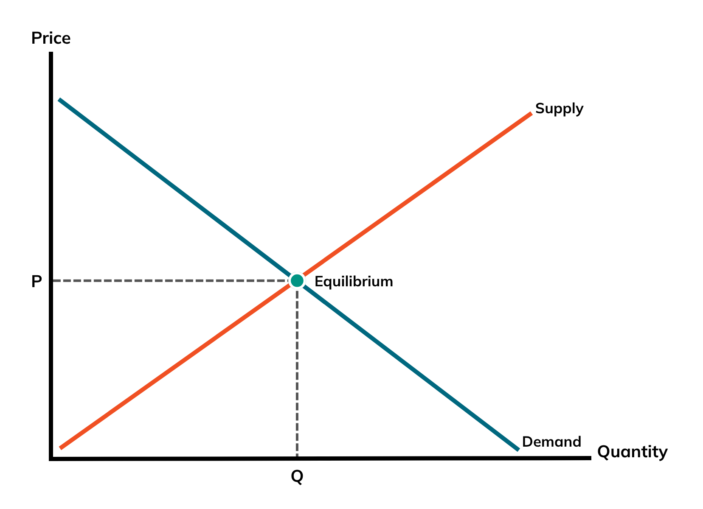
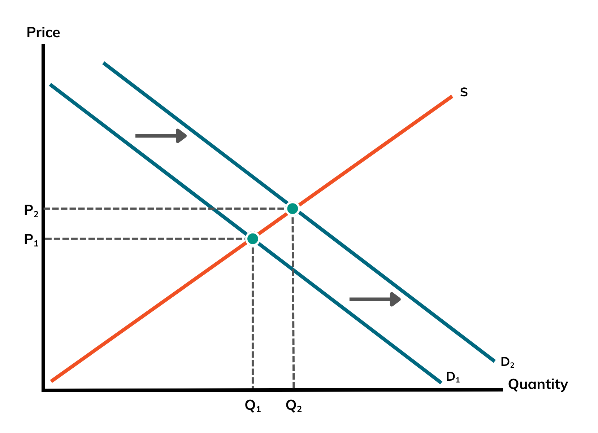
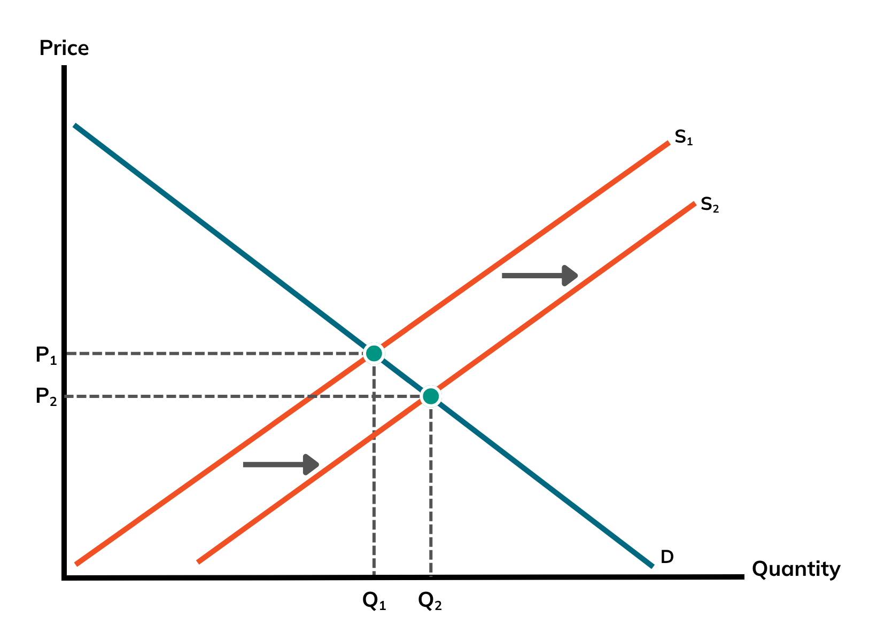

# Defining Demand & Supply

Demand and supply are the pillars of any market economy. They describe the relationship between buyers and sellers. A demand and supply graph is a graphical illustration of the relationship.

**Demand Curve**: The demand curve slopes downward as a result of the law of demand, which states that as the price of a good or service decreases, consumers can and will purchase more of such goods and services. Conversely, as the price increases, they will purchase less of it.

This inverse relationship between supply and demand is founded on two basic reasons:

1. **Income Effect:** When prices of a commodity fall, consumers’ purchasing power increases. In other words, people can buy more of that commodity with the same amount of money, which naturally leads to higher demand.  
2. **Substitution Effect:** When the price of a commodity decreases, consumers find cheaper alternatives. They are more likely to buy similar, cheaper options, leading to a decrease in that commodity’s demand.

**Supply Curve**: The supply curve bends upwards because of the law of supply, which states that whenever there is an increase in the price of a commodity, the manufacturers are more willing and able to supply more of it. In contrast, as the price decreases, manufacturers become less willing and less able to supply that commodity.

There are two main reasons for this inverse relationship:

1. **Profit Incentive:** When prices rise, producers see greater potential profits, which motivates them to increase their output.  
2. **Increasing Marginal Costs:** As firms produce more, they often face rising marginal costs: each extra unit may require more labor and materials. To cover these higher costs, producers need higher prices, which explains the upward slope.

# Visualizing Market Equilibrium

**Market equilibrium** occurs where the supply curve and demand curve intersect. This intersection determines the equilibrium price and quantity, the price at which the consumers' quantity demanded is equal to the producers' quantity supplied.

Market equilibrium is important for many reasons. At equilibrium:

1. There is no shortage (excess demand) or surplus (excess supply). Market forces are balanced.  
2. Resources are allocated efficiently. The market employs resources optimally since all produced commodities are consumed and meet consumers’ needs.

When the market is out of equilibrium, there will be surpluses or shortages. These conditions signal to both producers and consumers that adjustments are needed, and they typically respond without any centralized planning. This self-adjusting process is what Adam Smith famously called “the invisible hand” of the market: individuals acting in their own interest unintentionally promote the overall efficiency and balance of the economy.

* **Surplus:** When the price of a good or service is above the equilibrium, there will be excess supply. Producers must lower prices to clear their inventory, gradually moving the price back to the equilibrium.  
* **Shortage:** When the price is below the equilibrium, there will be excess demand. Producers can increase prices because of consumers’ high demand, which moves the price back to the equilibrium.

# Shifts in Curves: Causes & Effects

Changes in demand or supply will cause relative shifts in their curves, altering the equilibrium price and quantity.

A shift in the demand curve occurs when factors other than price cause consumers to buy more or less of a good or service at every price level. Several key factors can drive this shift, including changes in consumer preferences, income levels, the prices of substitute or complementary goods, population growth, and future expectations. For example, if consumers' income rises or a product becomes more fashionable, demand increases, shifting the demand curve to the right. This leads to a higher equilibrium price and quantity, as buyers are willing to pay more and purchase more overall. Conversely, if incomes fall or the product becomes outdated, demand decreases, shifting the curve to the left, resulting in a lower equilibrium price and quantity.

A shift in the supply curve happens when producers are willing to supply more or less of a good at every price point due to changes in non-price factors. These include variations in the cost of production, technological advancements, the number of suppliers, government taxes or subsidies, and producer expectations about future prices. When production becomes cheaper due to technology or subsidies, supply increases, shifting the curve to the right. This typically causes the equilibrium price to fall and the quantity sold to rise, as goods become cheaper and more abundant. On the other hand, if production costs rise or supply is disrupted, the curve shifts to the left, resulting in a higher equilibrium price and a lower quantity available in the market.

# Real-life Scenarios

In the smartphone market, the demand side is driven by consumers and organizations who purchase smartphones for various purposes, ranging from everyday communication and personal entertainment to professional productivity and business operations. As smartphones have become essential tools in modern life, the demand is influenced by evolving user needs, lifestyle trends, and technological advancements.

On the supply side, major corporations such as Apple and Samsung are responsible for manufacturing and distributing smartphones worldwide. These companies manage complex global supply chains and constantly adapt to cost pressures, technological changes, and consumer expectations.

Several market scenarios can affect the equilibrium between supply and demand. For instance, if manufacturers adopt new, cost-efficient production technologies, the supply curve shifts to the right. This increased efficiency allows producers to offer more units at lower costs and results in lower prices for consumers and a higher quantity of smartphones sold in the market.

If consumer preferences shift toward environmentally friendly smartphones, there will be an increase in demand for products that align with these values. As a result, the demand curve shifts to the right, leading to higher prices and greater sales volume for green smartphones. This reflects how changes in production methods and consumer behavior can significantly impact both market dynamics and business strategy.

# Conclusion

Demand and supply determine how resources are allocated in an economy. In a free market, their interactions set price levels and quantities, helping to ensure the efficient allocation of goods and services.

The fluctuation of supply or demand brought on by outside factors is an example of how markets are dynamic and how businesses, and consequently consumers, must adjust to shifts.

Equilibrium serves as a market’s regulator, balancing the interests of producers and consumers while minimizing waste. Real-world examples, such as the market for smartphones and energy markets, show how these economic principles operate in practice and shape the everyday decisions of individuals and firms.

# References

Britannica. (2024, January 27). *Supply and demand*. Www.britannica.com. [https://www.britannica.com/money/supply-and-demand](https://www.britannica.com/money/supply-and-demand)  

Chen, J. (2020, November 27). *Equilibrium*. Investopedia. [https://www.investopedia.com/terms/e/equilibrium.asp](https://www.investopedia.com/terms/e/equilibrium.asp)  

Fernando, J. (2024, June 27). *Law of Supply and Demand in Economics: How It Works*. Investopedia; Investopedia. [https://www.investopedia.com/terms/l/law-of-supply-demand.asp](https://www.investopedia.com/terms/l/law-of-supply-demand.asp)
  
Majaski, C. (2024, May 15). *What Is the Invisible Hand in Economics?* Investopedia. [https://www.investopedia.com/terms/i/invisiblehand.asp](https://www.investopedia.com/terms/i/invisiblehand.asp)