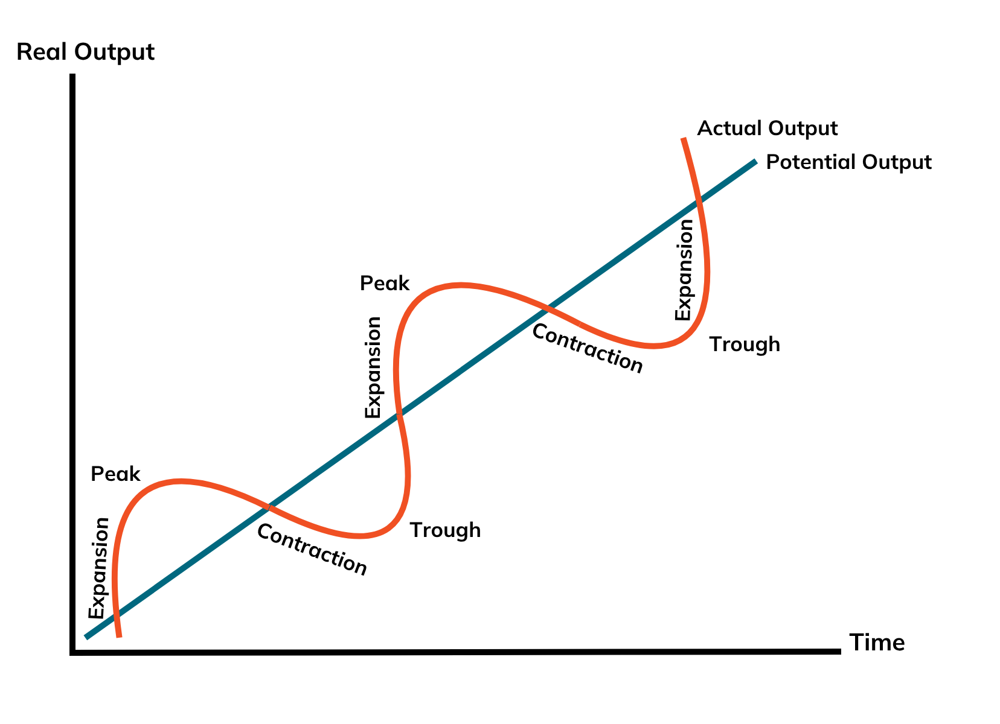

Music follows a rhythm, and so does the economy: a recurring cycle of expansion, peak, contraction, and trough. This pattern, known as the Business Cycle, reflects the natural fluctuations in economic activity over time. By recognizing these phases and understanding their implications, individuals, businesses, and policymakers can better prepare for shifts in the economic landscape and respond with greater confidence and foresight.

# Understanding the Business Cycle

The **business cycle** refers to the natural rise and fall of economic growth that occurs over time in an economy. It is measured by fluctuations in real GDP and other economic indicators like employment, consumer spending, and industrial production. These ups and downs are recurring, though not always predictable in timing or magnitude. There are four stages of a business cycle: expansion, peak, recession, and trough.

## Expansion Stage

Let’s start with the **Expansion** stage. Often called the "boom" stage, expansion is when the economy grows. During this period, businesses thrive, jobs are plentiful, incomes rise, and consumers spend more. Investment increases, productivity improves, and confidence runs high. Governments may collect more in taxes due to rising incomes, and interest rates might remain moderate to stimulate further growth. This is the most optimistic phase, where opportunities appear abundant and economic activity steadily climbs. As long as economic conditions are in favor, expansion will continue to rise.

## Peak Stage

The **Peak** is the point at which the economy hits its maximum output in the current cycle. Growth reaches its limit, and signs of overheating may emerge: prices increase quickly (inflation), borrowing can rise sharply, and labor markets become tight. While still appearing strong on the surface, this stage often carries the seeds of slowdown. Businesses might overextend, and central banks could tighten monetary policies to prevent runaway inflation, making borrowing more expensive.

Inflation is another danger at the peak stage. Increasing prices will suppress businesses and consumers' spending, leading to a decrease in the production of goods and services. This indicates that the economy might be going towards a downturn. However, the measurement of a peak is only known once the next period falls from it, so it’s only known in hindsight. As a result, a peak can resemble expansion until a period of time has elapsed. That’s why it’s important for entrepreneurs to constantly watch inflation rates and job figures to act accordingly.

## Contraction Stage

The **Contraction** stage follows the peak and represents a period of decline in economic activity. Consumer confidence wanes, spending drops, and businesses may reduce production, leading to layoffs and rising unemployment. Investment decreases, and GDP shrinks. Governments might respond with stimulus measures to soften the impact, such as cutting interest rates or increasing spending. The deeper and longer the contraction, the more severe the economic and social effects.

## Trough Stage

The **Trough** is the lowest point of the cycle. It marks the end of the recession and the beginning of a new expansion. Economic indicators stabilize, and early signs of recovery emerge, like gradual job growth or increased consumer spending. Demand starts to grow thanks to low prices, leading to increases in supply and production. This stage can be difficult to pinpoint in real-time, but it is crucial as it sets the stage for the next upward trend. From this base, the economy begins to rebuild strength, laying the foundation for renewed growth.

## Visualizing the Business Cycle

An easy way to picture this cycle is to think of it like riding a bike uphill and downhill. Expansion is the uphill ride when you're full of energy and strong. The peak is reaching the top, tired and exhausted, ready to come back. Then comes the contraction, the downhill part where you slow down and try to stay in control. Finally, the trough is the flat road at the bottom where you catch your breath and get ready to pedal again.

In short, the business cycle is the economy’s rhythm, rising and falling through distinct phases that affect everyone. Understanding this cycle helps governments, companies, and individuals make smarter financial decisions, like when to invest, save, or spend their money according to the current stage of the economy.

# Historical Patterns of Business Cycle

Business cycles simply do not exist in contemporary times; it has also persisted throughout history. Some notable patterns include the Great Depression (1929 – 1939\) and the Great Recession (2007 – 2009).

## The Great Depression (1929 – 1939\)

The Great Depression, which began in 1929, was the most severe and far-reaching economic crisis of the 20th century. Triggered by a devastating stock market crash in the United States, it quickly evolved into a global financial meltdown that reshaped economies, institutions, and lives across the world.

The crisis began when the U.S. stock market, fueled by speculation and easy credit, collapsed in October 1929\. But the deeper causes ran further: income inequality, overproduction in industry and farming, a fragile banking system, and a slowdown in consumer spending all played a role. Once the financial sector began to unravel, panic spread. Banks failed in large numbers, wiping out savings and cutting off credit. Businesses closed, factories stood idle, and by 1933, nearly a quarter of the American workforce was unemployed.

The depression’s reach quickly extended beyond U.S. borders. Countries around the world, many of which depended heavily on U.S. loans and trade, were pulled into the downturn. Germany faced a collapse in banking and skyrocketing unemployment, creating fertile ground for political extremism. Britain struggled with declining exports and rising joblessness. In Latin America, Asia, and Africa, falling commodity prices devastated economies built on exports. International trade plummeted, shrinking by more than half during the early 1930s, deepening the crisis in both industrial and colonial economies.

Recovery came slowly and differently for each nation. In the United States, President Franklin D. Roosevelt’s New Deal brought relief through massive public works, financial reform, and social programs. Agencies like the WPA and CCC created millions of jobs, while new regulations helped restore confidence in banks and markets.

Other countries took different routes. Britain left the gold standard and encouraged domestic demand through low interest rates and a housing boom. Germany, under the Nazi regime, recovered through state-led rearmament and infrastructure spending, though at the cost of civil liberties and political freedom. Sweden and other Nordic countries pioneered early welfare state models, blending social protection with economic reform. Meanwhile, Japan recovered by abandoning gold, boosting state spending, and increasing military production.

The Great Depression reshaped the way the world thinks about economics and government. It revealed the dangers of unregulated markets, the fragility of global finance, and the need for coordinated policy in times of crisis. Its legacy lives on in the institutions and safeguards that remain in place today to prevent such a collapse from happening again.

## The Great Recession (2007 – 2009\)

The Great Recession was a worldwide economic downturn that began in late 2007 and unfolded into the most significant financial crisis since the Great Depression. Originating in the United States, the crisis exposed critical flaws in global financial systems and highlighted the risks of deregulated markets, excessive leverage, and housing-driven speculation.

The crisis took root in the U.S. housing sector, where years of aggressive mortgage lending and financial innovation had led to the creation of high-risk securities tied to subprime home loans. As housing prices peaked and began to fall, defaults surged and mortgage-backed securities lost their value. Financial institutions worldwide, many of which were heavily exposed to these assets, faced severe liquidity shortages. The collapse of Lehman Brothers, the US’s fourth-largest investment bank, in September 2008 marked a tipping point, triggering panic across global markets and a widespread credit freeze.

The effects were swift and far-reaching. The US alone lost more than 8.7 million jobs, millions of homes entered foreclosure, and household wealth was significantly eroded. Financial markets saw dramatic losses, and credit availability contracted sharply. Globally, advanced and developing economies alike experienced contractions in output, trade, and employment. The crisis spilled over into Europe, where banking failures and public debt concerns sparked prolonged recessions in several countries, notably Greece, Ireland, and Spain. Emerging economies also suffered from declining export demand and capital outflows, though many rebounded more quickly.

In response, governments and central banks launched aggressive stabilization efforts. The U.S. implemented fiscal stimulus through the American Recovery and Reinvestment Act, alongside emergency monetary policies including near-zero interest rates and quantitative easing by the Federal Reserve. The European Central Bank took similar steps, though the eurozone's recovery was hampered by internal imbalances and austerity policies in some member states. China introduced a large-scale infrastructure-driven stimulus package, which helped cushion its economy and contributed to global recovery demand. The global response marked a turning point in the role of monetary authorities and fiscal policy in crisis management. Reforms followed across financial sectors, focusing on bank capital requirements, risk transparency, and systemic regulation.

The Great Recession remains a defining event in recent economic history. Its legacy includes not only institutional reforms but also broader questions about inequality, globalization, and the long-term resilience of financial systems. Understanding its causes and the varied national responses is essential for shaping more sustainable economic frameworks in the future.

# Planning Ahead for the Business Cycle

The business cycle is a natural pattern of economic activity. Though its exact timing is unpredictable, each phase offers distinct challenges and opportunities. Planning with the cycle in mind enables individuals and businesses to build resilience, protect resources, and respond decisively when conditions change.

## Expansion: Building Momentum with Caution

Periods of economic growth present a chance to strengthen long-term financial stability. This is the time to prioritize savings accumulation, reduce outstanding debt, and invest in sustainable growth — whether through personal development, operational upgrades, or income diversification. Maintaining disciplined spending and healthy liquidity during expansion not only enhances stability but also creates strategic advantages when the cycle shifts.

## Peak: Recognizing Limits and Reducing Exposure

At the peak of economic performance, a more cautious and efficiency-focused approach becomes necessary. Rising costs, tight labor markets, and increased borrowing rates often signal the need for restraint. Individuals and organizations alike should reassess their financial exposure, delay major commitments, and secure fixed-rate financing where possible. Emphasizing operational discipline and risk management helps maintain flexibility heading into a potential downturn.

## Contraction: Preserving Stability and Navigating Uncertainty

Economic contractions require a focus on preservation and adaptability. Liquidity becomes essential, and minimizing non-essential spending helps safeguard critical operations or household needs. Simplifying financial obligations, maintaining access to credit, and prioritizing stability over expansion are key during this phase. Emotional discipline is equally important — avoiding reactive decisions can prevent long-term setbacks.

## Trough: Positioning for Recovery

As economic indicators stabilize, the groundwork for recovery begins. This phase calls for cautious economic optimism — gradually reintroducing investment, exploring undervalued opportunities, and restoring suspended initiatives. Planning during this stage should emphasize long-term resilience rather than short-term gain. Those who remained prepared during the contraction are well-positioned to move early and confidently into the next cycle of growth.

# References

Achuthan, L. (2024, June 6). *Business cycle: What it is, how to measure it, the 4 phases.* Investopedia. [https://www.investopedia.com/terms/b/businesscycle.asp](https://www.investopedia.com/terms/b/businesscycle.asp)

CFI. (2023, April 18). *Business Cycle.* Corporate Finance Institute. [https://corporatefinanceinstitute.com/resources/economics/business-cycle/](https://corporatefinanceinstitute.com/resources/economics/business-cycle/)

Guidant. (2024, July 12). *The Four Stages of Business Cycles \- Guidant.* Guidant. [https://www.guidantfinancial.com/blog/business-cycles/](https://www.guidantfinancial.com/blog/business-cycles/)

Romer, C. D., & Pells, R. H. (2019). *Great Depression \- Causes of the decline.* In Encyclopedia Britannica. [https://www.britannica.com/event/Great-Depression/Causes-of-the-decline](https://www.britannica.com/event/Great-Depression/Causes-of-the-decline)

Weinberg, J. (2013, November 22). *The Great Recession and Its Aftermath.* Federal Reserve History; Federal Reserve History. [https://www.federalreservehistory.org/essays/great-recession-and-its-aftermath](https://www.federalreservehistory.org/essays/great-recession-and-its-aftermath)

The Investopedia Team. (2023, December 18). *The Great Recession.* Investopedia. [https://www.investopedia.com/terms/g/great-recession.asp](https://www.investopedia.com/terms/g/great-recession.asp)

Schenk, J. (2023, June 13). *Four Strategies to Plan for Economic Cycles and Market Changes | UCFS.* United Consumer Financial Services. [https://www.ucfs.net/four-strategies-to-plan-for-economic-cycles-and-market-changes/](https://www.ucfs.net/four-strategies-to-plan-for-economic-cycles-and-market-changes/)